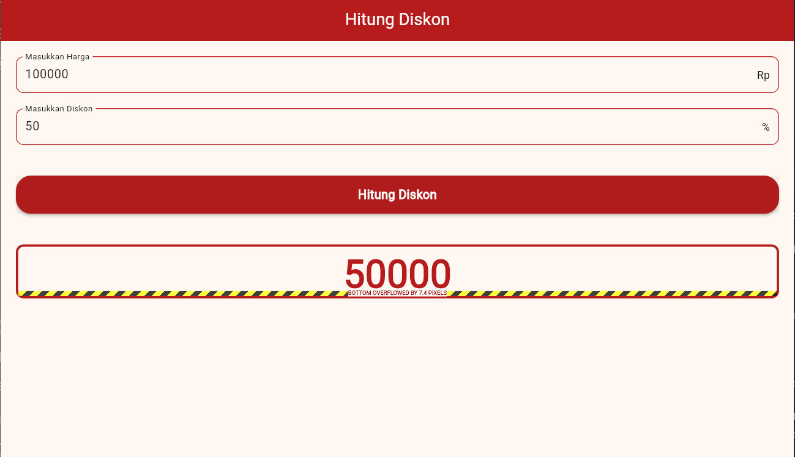

# 🕰️ Watch Order App - UTS Pemrograman Mobile

## 👤 Informasi Mahasiswa

- *Nama*: [Ryan Rambu Rabbani]
- *NIM*: [2022804178]
- *Prodi*: [Sistem Informasi 6A (pagi)]
- *Semester*: [6]

---

## 📝 Nama Aplikasi

Aplikasi Flutter ini dibuat sebagai Ujian Tengah Semester (UTS) untuk mata
kuliah Mobile Programming.
Aplikasi ini merupakan aplikasi hitung diskon.

## 📝 Deskripsi  Aplikasi

> Aplikasi hitung diskon ini, dapat membantu untuk mengecek harga diskon dan berapa persen diskon yang akan didapat oleh pembeli agar tidak bingung ketika berbelanja.*.
> mungkin aplikasi ini terlihat simple, namun sangat berguna bagi yang membutuhkan, apalagi bagi yang kurang paham tentang apa itu diskon.

---## 📸 Screenshot Aplikasi

> ✨ *Berikut adalah beberapa tampilan dari aplikasi Hitung Diskon:* ✨

  
*Tampilan halaman saat membuka aplikasi*

  
*Tampilan halaman utama dengan perintah memasukan harga beserta diskonya dan tampilan berubah dan hasilnya akan tampil*

